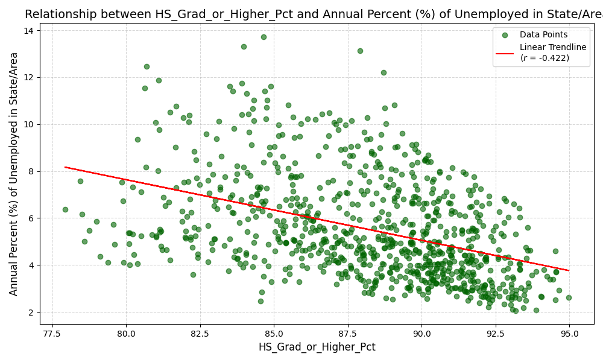
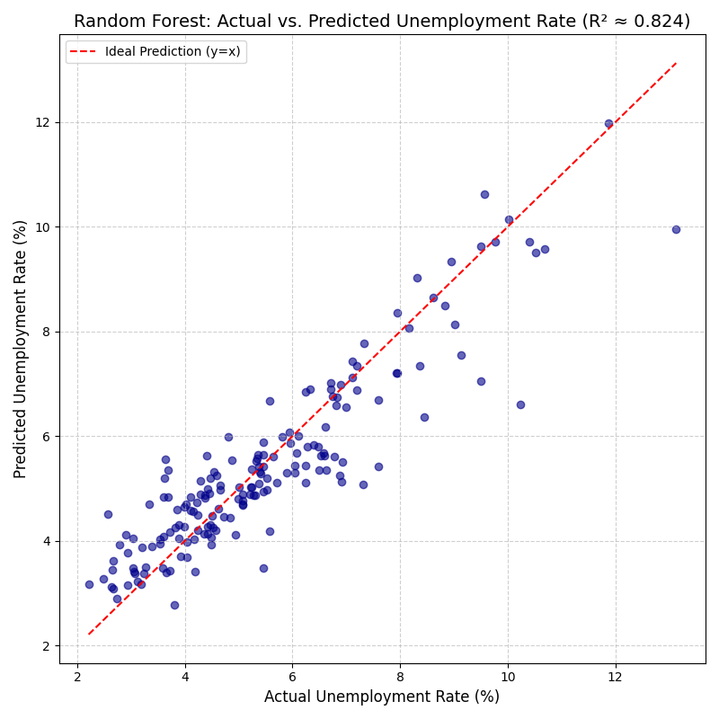

# Final Project Submission
Grange Kalinich

### Overview
Your final project submission will include a report summarizing your project and data curation actions as well as the actual artifacts (e.g., scripts, data, results, visualizations). Your project grade will be based on both the report and the digital artifacts submitted as described below.

### The Correlation Between Educational Attainment and State Unemployment Rates (2005-2022)
Title of your project.

### Contributors
Bulleted list of contributors (with optional ORCIDs).

- Grange Kalinich (Individual Project)

### Summary
[500-1000 words] Description of your project, motivation, research question(s), and any findings.

The primary goal of this project was to analyze the relationship between educational attainment and unemployment rates across the United States at the state level over a multi-year period (2005-2022, excluding 2020). The motivation was to determine the correlation between various education metrics and employment outcomes and to build a simple predictive model for state unemployment. The work involved acquiring, cleaning, and integrating time series data from two distinct federal sources before performing analysis and modeling.

The research questions guiding this analysis were:
1.  What is the year-to-year correlation between different levels of education and the overall unemployment rate in U.S. states? (This was modified from the original "Bachelor’s degree or higher" to allow for a broader analysis of all attainment levels).
2.  Can educational attainment variables, when combined with other demographic factors, be used to predict a state’s unemployment rate?.

**Key Findings:**

A modest negative correlation was observed between the percentage of the population with a high school degree or higher and the unemployment rate (correlation coefficient $\approx -0.422$). This suggests that generally, states with higher educational attainment levels tend to have lower unemployment, though the relationship is not strong enough on its own to be a primary driver.

For the predictive modeling, a Random Forest Regressor model ($R^2 \approx 0.824$) significantly outperformed a simple Linear Regression model ($R^2 \approx 0.258$) in predicting state unemployment. The feature importance analysis from the Random Forest model was the most telling result: the `Year` variable was found to be the overwhelmingly most important feature ($0.596$ importance). Educational attainment variables, such as `Edu_Associates_Degree_Pct` ($0.136$ importance), were of secondary importance.

This result leads to the conclusion that macroeconomic timing, which is captured by the `Year` variable and reflects national recessions and recoveries, is the dominant driver of state unemployment rates. Unemployment is cyclical, and the specific educational mix within a state is a minimal predictor compared to the broader economic climate. The non-linear Random Forest model performed better because it was able to capture these "boom and bust" cycles that the linear model could not.

### Data Profile
[500-1000 words] Description of each dataset used including all ethical/legal constraints.

The project integrates data from two distinct datasets covering the period from 2005 to 2022 (excluding the 2020 ACS experimental release for consistency).

**Dataset 1: Educational Attainment Data (U.S. Census Bureau)**
* **Source:** [*American Community Survey (ACS) 1-Year Data (2005-2024)*](https://www.census.gov/data/developers/data-sets/acs-1year.html).
* **Content:** This dataset contains raw counts of the population aged 25 and over by their highest level of educational attainment for each U.S. state. The raw ACS variables (e.g., B15003_xxxE) were programmatically accessed.
* **Acquisition:** Data was programmatically acquired using a Python script in the [DataA&I+P&C.ipynb](InterimStatusReportItems/DataA&I+P&C.ipynb) notebook via the U.S. Census Bureau API. This required handling changing variable codes for the same data metrics across different years.
* **Ethical/Legal Constraints:** The data is publicly available, a product of the U.S. Government, and is typically open for use with proper attribution. A key constraint is the ACS's methodology, which only reports data for areas with a population of 65,000 or more, potentially introducing sampling error or lag for smaller states. The project ensures compliance with U.S. Government data policies and requires proper citation.

**Dataset 2: Unemployment Data (U.S. Bureau of Labor Statistics)**
* **Source:** [*Unemployment in America Per US State*](https://www.kaggle.com/datasets/justin2028/unemployment-in-america-per-us-state?select=Unemployment+in+America+Per+US+State.csv), acquired as a CSV file from Kaggle, with the original source being the U.S. Bureau of Labor Statistics (BLS).
* **Content:** This dataset originally provided monthly time series data on total civilian non-institutional population, labor force, employment, and unemployment counts for U.S. states. The raw data spanned 1976-2022.
* **Acquisition:** The data was loaded directly from a local CSV file. As part of the integration and transformation steps in [DataA&I+P&C.ipynb](InterimStatusReportItems/DataA&I+P&C.ipynb), the monthly values were aggregated to create annual averages for consistency with the ACS 1-Year estimates.
* **Ethical/Legal Constraints:** This data is also public U.S. Government data, requiring proper citation of the BLS. The Kaggle source used for distribution must also be noted, and its terms of use considered.

**Data Integration:**
The final integrated dataset was created by performing an inner merge between the two datasets on three common keys: `State`, `State_FIPS` (code), and `Year`. This process ensured only matching state-year records were kept, resulting in the final [merged_education_unemployment_data.csv](merged_education_unemployment_data.csv) file. The merging step also removed inconsistent data points like 'Puerto Rico' (present only in the education data) and required the cleaning of state name strings.

### Data Quality
[500-1000 words] Summary of the quality assessment and findings.

Data quality assessment, profiling, and cleaning were performed across the [DataA&I+P&C.ipynb](InterimStatusReportItems/DataA&I+P&C.ipynb) and [DataA&M.ipynb](DataA&M.ipynb) notebooks.

**Cleaning and Consistency:**
* **Geographical/String Cleaning:** State names were standardized, and mismatched geographical entities like 'Puerto Rico' and 'New York city' were identified and removed or cleaned during the integration step in [DataA&I+P&C.ipynb](InterimStatusReportItems/DataA&I+P&C.ipynb).
* **Temporal Consistency:** To align the datasets, the monthly unemployment figures were aggregated to annual averages for the years 2005 through 2022.
* **Missing Values:** The inner merge operation in the integration step intrinsically handled missing values by excluding state-year combinations where data was not available from both sources.
* **Outlier/Range Check (Profiling):** An initial profiling in [DataA&M.ipynb](DataA&M.ipynb) confirmed that the resulting values were within expected real-world ranges:
    * The `Annual Percent (%) of Unemployed in State/Area` ranged from a minimum of 2.06% to a maximum of 13.72%, with a mean of 5.52%.
    * The percentage of the population with a High School Degree or Higher ranged from 77.93% to 94.98%.
    * No obvious syntactic outliers (e.g., 0% or 100% unemployment) were found.

**Data Validation:**
The derived mean unemployment rate of 5.52% for the 2005-2022 period was validated against historical benchmarks. A comparison with the long-term U.S. average unemployment rate (5.67% from 1948-2025 according to U.S. Bureau of Labor Statistics data reported by [TradingEconomics](https://tradingeconomics.com/united-states/unemployment-rate) stats page) confirmed the general accuracy of the aggregated and calculated unemployment percentage column.

**Feature Engineering and Selection:**
To prepare the data for modeling, counts (like `Total_Pop_25_Plus` and raw education counts) were converted to percentages. This transformation normalizes the data, making state-to-state and year-to-year comparisons more equitable, as the focus is on *rate* and *proportion*, not absolute population. Furthermore, for the final model, highly correlated and redundant columns were dropped (e.g., all raw counts, `HS_Grad_or_Higher_Pct`) to ensure the predictive model could independently evaluate the contribution of each specific education level. The final dataset for modeling included the `Year` and eight specific education percentage columns.

### Findings
[~500 words] Description of any findings including numeric results and/or visualizations.

The analysis was focused on answering the two primary research questions through correlation and predictive modeling, as detailed in the [DataA&M.ipynb](DataA&M.ipynb) notebook.

**Research Question 1: Correlation between Educational Attainment and Unemployment**

The correlation coefficient between a state’s percentage of population with a high school degree or higher (`HS_Grad_or_Higher_Pct`) and the `Annual Percent (%) of Unemployed in State/Area` was calculated to be **$-0.422$**.
This negative correlation is visually represented in the scatter plot below, where higher educational attainment is generally associated with a lower unemployment rate, as expected. However, the correlation is not close to $-1.0$, indicating that educational attainment is not the sole or primary factor determining unemployment at the state level.

**Research Question 2: Predicting Unemployment**

Two regression models were tested to predict the state unemployment rate:

| Model | RMSE | $R^2$ Score |
| :--- | :--- | :--- |
| Linear Regression (LR) | 1.750 | 0.258 |
| Random Forest Regressor (RF) | 0.853 | 0.824 |
*Data derived from the execution of [DataA&M.ipynb](DataA&M.ipynb)*.

The Random Forest Regressor model significantly outperformed the simpler Linear Regression model, suggesting that the relationship between the predictors and unemployment is non-linear. The graph below shows the actual vs. predicted values for the superior Random Forest model.

The feature importance analysis for the Random Forest Regressor clearly shows which variables drove the predictive power:

| Feature | Random Forest Importance |
| :--- | :--- |
| Year | 0.596 |
| Edu_Associates_Degree_Pct | 0.136 |
| Edu_12th_No_Diploma_Pct | 0.101 |
| Edu_Bachelors_Degree_Pct | 0.042 |
| *Other Education Pct Variables* | < 0.04 |
*Data derived from the execution of [DataA&M.ipynb](DataA&M.ipynb)*.

The overwhelming importance of the `Year` variable ($0.596$) relative to any specific education level confirms that macroeconomic cycles are the primary drivers of unemployment variance across the states and years in the dataset instead of the state's educational mix.

### Future Work
[~500-1000 words] Brief discussion of any lessons learned and potential future work.

The main lesson learned from this project is the powerful, cyclical nature of unemployment, as evidenced by the high predictive power of the `Year` variable. State-level educational attainment, while negatively correlated, is a secondary predictor, indicating that during national economic crises (like the 2008 recession), unemployment rises regardless of a state's academic profile. The importance of selecting an appropriate, non-linear model (Random Forest) was also a critical lesson, as the Linear Regression failed to capture these economic cycles.

Potential future work to build upon this analysis includes:

* **Model Refinement with Time Series Techniques:** Moving beyond standard regression models to explicitly incorporate the time component of the data. Future work could explore time-series specific models to better model the dependency on `Year` and provide a more robust understanding of long-term and cyclical trends.
* **Increased Granularity:** The current state-level analysis smooths out significant internal variances. Future work could transition the analysis to the county or similar level. This would allow for a more localized study of how education profiles impact employment outcomes in specific economic regions.
* **Integration of Additional Economic Variables:** To create a more comprehensive predictive model, future versions could integrate additional economic factors such as:
    * Sector-specific employment percentages.
    * State-level Gross Domestic Product (GDP).
    * Poverty rates or average state income.
    * Policy variables (e.g., minimum wage changes).
* **Data Consistency and Completeness:** A specific item for future work is to research and implement a safe and consistent method for incorporating the unique 2020 ACS 1-Year Experimental Data Release, which was excluded from this analysis for consistency, to ensure the time series remains unbroken.

### Reproducing
Sequence of steps required for someone else to reproduce your results.

The entire workflow, from data acquisition to final analysis and visualization, is automated through the provided Python notebooks and scripts.

1.  **Repository Setup:** Clone the project repository from GitHub to your local machine.
2.  **Dependencies:** Install all necessary Python dependencies using the [requirements.txt](requirements.txt) file found in the repository.
3.  **Data Acquisition:**
    * A U.S. Census Bureau API key is required and should be configured as an environment variable or within a configuration file (not committed to the repository).
    * Ensure the local unemployment CSV file ([Unemployment_in_America_Per_US_State.csv](Unemployment_in_America_Per_US_State.csv)) is present in the expected directory.
4.  **Integration and Cleaning:** Run all cells in the [DataA&I+P&C.ipynb](InterimStatusReportItems/DataA&I+P&C.ipynb) notebook in sequence. This script will:
    * Call the Census API to acquire and structure the education data.
    * Load and clean the unemployment data.
    * Perform the inner merge on `State`, `State_FIPS`, and `Year`.
    * Output the final clean data as [merged_education_unemployment_data.csv](merged_education_unemployment_data.csv).
5.  **Analysis and Modeling:** Run all cells in the [DataA&M.ipynb](DataA&M.ipynb) notebook in sequence. This script will:
    * Perform final data profiling and feature engineering (converting counts to percentages, dropping redundant columns).
    * Set up and train the Linear Regression and Random Forest Regressor models.
    * Generate and save the final visualizations ([ForestRegressorGraph-AvsP.png](ForestRegressorGraph-AvsP.png), [hs_grad_vs_unemployment_rate_final.png](hs_grad_vs_unemployment_rate_final.png)) and print model results (RMSE, $R^2$) to the console.

### References
Formatted citations for any papers, datasets, or software used in your project.

1.  **Educational Attainment Data:** U.S. Census Bureau. [*American Community Survey (ACS) 1-Year Data (2005-2024).*](https://www.census.gov/data/developers/data-sets/acs-1year.html) Accessed via Census API.
2.  **Unemployment Data:** U.S. Bureau of Labor Statistics (BLS). [*Unemployment in America Per US State.*](https://www.kaggle.com/datasets/justin2028/unemployment-in-america-per-us-state?select=Unemployment+in+America+Per+US+State.csv) Acquired via Kaggle.
3.  **Software:** Python 3.x with supporting libraries (e.g., `pandas`, `numpy`, `scikit-learn`, `matplotlib`). Specific dependencies are listed in the [requirements.txt](requirements.txt) file in the project repository.
4. **External Validation Data 1:** Federal Reserve Economic Data (FRED) St. Louis. [*High School Graduate or Higher for Illinois.*](https://fred.stlouisfed.org/series/GCT1501IL) Downloaded [file here]((GCT1501IL.csv)). Data from U.S. Census Bureau.
5.  **External Validation Data 2:** Trading Economics. [*United States Unemployment Rate.*]([https://tradingeconomics.com/united-states/unemployment-rate]) Data from U.S. Bureau of Labor Statistics. 

